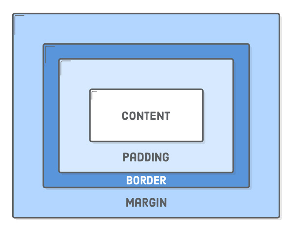

% Getty CodeCamp
% Session 4: The Box Model and Beyond

# Thinking Inside the Box
- So far we have talked about how to modify basic properties like `font-family`, `color`, and size.
- Tonight we'll learn about how to position elements around the page, starting with the basic building block of any CSS layout, the **box model**.

## Block and Inline Elements
- All the HTML elements we are working with come with a default box-behavior.
- `block` and `inline` are the basic types.
- You can override an elements box behavior in CSS with a `display: block` or `display: inline` rule.

## Basic Box example
- Go to `exercises/ex-4-1-box-model.html` to follow along.

---

### Default Behavior

```css
/* Add these rules to see the box boundaries */
h1, p {
  background-color: #DDE0E3;    /* Light gray */
}

em, strong {
  background-color: #B2D6FF;    /* Light blue */
}
```

---

### What about `<div>` elements?

## Anatomy of the Box Model


---
- **Content** – The text, image, or other media content in the element.
- **Padding** – The space between the box’s content and its border.
- **Border** – The line between the box’s padding and margin.
- **Margin** – The space between the box and surrounding boxes.


# Beyond the Box Model

- But we've remained confined in the default vertical "flow" of elements on the page.

## Floats

- “Floats” allow us to put block-level elements side-by-side instead of on top
  of each other. 
- This allows us to build all sorts of layouts, including
  sidebars, multi-column pages, grids, and magazine-style articles with text
  flowing around an image. This is where we finally start creating real web
  pages.

 
